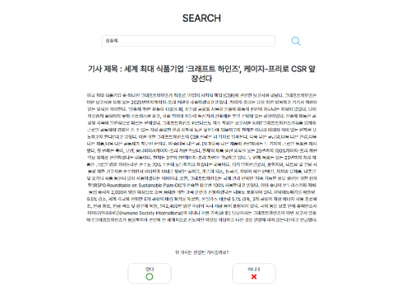

# 자극에 대한 역치 감소
2023 빅데이터 시스템 교과목 프로젝트 : 자극에 대한 역치 감소

#

### 팀 구성
Leader : 조민수(FE)  
Mates : 서종원(Server) / 민웅규(DB)

#

### 기술 스택
Front End : React JS, JavaScript, Boostrap, react-chart  
Back End : FastAPI, Python3  
Database : MongoDB  

# 

### Project 개요
진짜 News와 가짜 News를 섞은 Data를 기반으로 한 Quiz 해결하기

### Project 의의
- 자극적 제목을 통한 낚시성 기사에 대한 비판적 사고 함양
- React JS와 FastAPI, MongoDB를 통한 대용량 데이터 처리 웹 서비스 개발
- 게임과 같은 방법으로 친근하고, 가볍게 낚시성 기사에 대한 접근
- 제목에 속아 생기는 확증편향을 줄이고, 객관적 시선 함양

### Project 기능
- 카테고리별 기사 분류 > 자동생성 낚시성 기사 / 직접생성 낚시성 기사 / 자동생성 비낚시성 기사 구분
- 검색 > 해당 기사가 진실인지 거짓인지 판단
- 기사 내에 거짓 문장 판단
- 기사와 알맞은 제목 선택

#

### 사용 Data

#

## Project 결과 화면
### Start Page

#

### Game Category 선택

#

### Game 내부 Stage

#

#

### Chart Page

#

#

### Search Page

